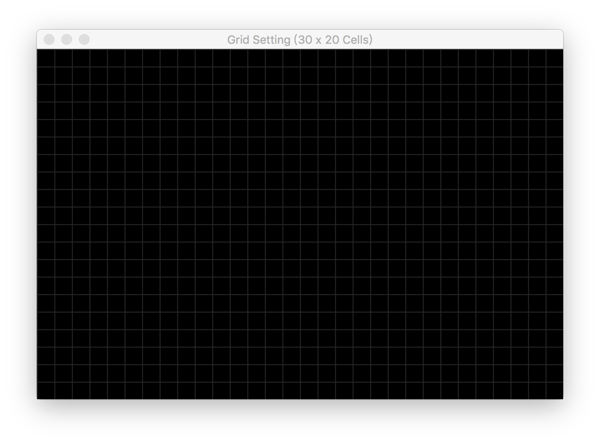
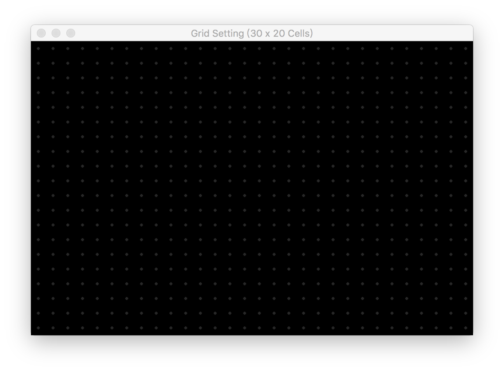
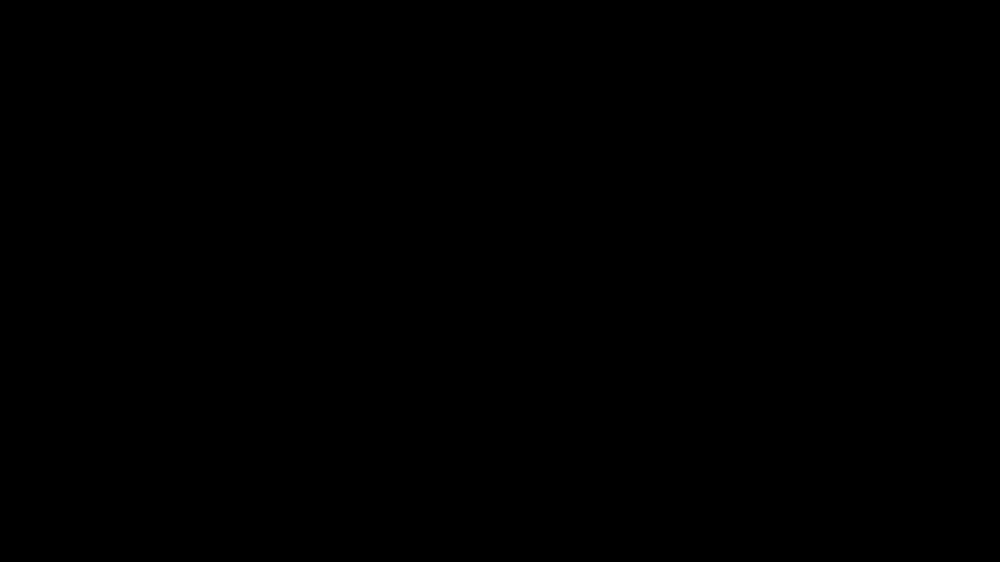

**Random Maze Generator and A-Star Solver**
<br> - *an application of graph theory algorithms in computer game programming*

[](https://travis-ci.org/hubotio/hubot)
[](https://coveralls.io/github/hubotio/hubot?branch=master)

**Abstract** Procedural Content Generation (PCG) is an excellent application of graph theory algorithms in computer game making - levels generated with algorithms possess much richer details than levels designed entirely by hand. We implemented a maze generator that demonstrates the construction processes of mazes using four algorithms and two types of representation methods. The first type of representation renders channels between adjacent connected cells; the second type renders walls between disconnected adjacent cells. While Depth-First Search and Randomized Prim require the first type of representation, Recursive Division and Randomized Kruskal must be based on the second type. All algorithms utilized in this study generate mazes with no cyclic routes or enclosed spaces, which guarantees the existence of a unique path between any two cells in the maze. We discussed each algorithm's potential usage in computer games programming, according to the characteristics of the mazes they generated. <!-- Some techniques for improving the efficiency of rendering were discussed at the end of this paper. -->

**Requirements**
* Python 3.5+ (64-Bit)
* SDL and PyGame
* Tkinter

**Keywords** procedural content generation, undirected graphs, minimum spanning tree, recursive division, A-star search

---

**-- Preparation --**

Our old rules say, before implementing any graph algorithms, let us define some *Abstract Data Types* (ADT) for representing graphs and their class methods. ADT is the foundation to organize the logic of our code. A frame of my implementation is provided here. Please read `Maze.structs` for details.
```Python
from copy import deepcopy

class Maze(object):
    """Essentially an undirected graph."""

    def __init__(self):
        self.__nodes = []
        self.__walls = []

    @property
    def nodes(self):
        return deepcopy(self.__nodes)

    @property
    def walls(self):
        return deepcopy(self.__walls)

    def InsertNode(self, node):
        pass  # some codes omitted here

    def SetVisited(self, vect):
        pass  # some codes omitted here

    def hasNode(self, vect):
        vects = [node.current for node in self.nodes]
        return vect in vects

    def GetNode(self, vect):
        for node in self.__nodes:
            if node.current == vect:
                return node
        print("Node not found!")

    def SetConnected(self, vect_1, vect_2):
        pass  # some codes omitted here

    def SetApart(self, vect_1, vect_2):
        pass  # some codes omitted here

    def __str__(self):
        pass  # some codes omitted here

class Node(object):
    """Data structure for representing each cell."""

    def __init__(self, current, neighbors):
        self.__visited   = False  # by default set it unvisited
        self.__current   = current
        self.__neighbors = neighbors

    @property
    def visited(self):
        return self.__visited

    @visited.setter
    def visited(self, value):
        self.__visited = value

    @property
    def current(self):
        return self.__current  # deepcopy() removed

    @property
    def neighbors(self):
        return self.__neighbors  # deepcopy() removed

    def AddNeighbor(self, new):
        pass  # some codes omitted here

    def DelNeighbor(self, target):
        pass  # some codes omitted here

    def ListDisconnected(self):
        """Enumerates a node's unvisited neighbors."""
        for valid in validNeighbors(self.current):
            if valid not in self.neighbors:
                yield valid

    def __eq__(self, other):
        if isinstance(other, Node):
            return self.current == other.current
        else:
            return NotImplemented

    def __repr__(self):
        name    = self.current
        content = self.neighbors
        return '{!r}: {!r}'.format(name, content)
```
An undirected graph with no concern about traversing directions is sufficient to represent a maze. As long as two cells are connected, you can visit the other from any one of them. Connectivity relationships between cells can be modified via `Maze.SetConnected()` and `Maze.SetApart()`, which in a lower level invokes `Node.AddNeighbor()` and `Node.DelNeighbor()`. In addition to `current` and `neighbors`, a `Node` instance has an attribute named `visited`, which can be modified via `Maze.SetVisited()`. This attribute might be useful or useless because it is sufficient to tell that from each cell's connected neighbors. Just in case, a `Wall` class is defined to represent the starting point and finishing point for rendering.

We need two types of representations to render the mazes: one renders channels between adjacent connected cells, which is called *node-based*; the other renders walls between adjacent disconnected cells, which is called *wall-based*. *Depth-First Search* and *Prim's Algorithm* start from a maze with all cells unvisited, and the first type of representation is suggested. In *Recursive Division*, however, the maze's initial status has all adjacent cells connected. It is suggested to use the second type of representation.

In principle, the selection is not compulsory, but a proper representation method would help us understand an algorithm much better. The `visited` property of each cell should or should not be modified, for that as long as a cell is visited, it is also connected with a part of the generated body.

The computation and rendering processes must be separated, namely, each time the maze structure is modified, we create a deep copy of the current status and cache it. The frames are rendered one by one after the generation, for which we need a class to store each status.
```Python
class Frame(object):
    """Consists of a vector instance representing
    the operational unit and a Maze instance."""
    def __init__(self, head, maze):
        self.__head = head  # the cell that is leading the generation
        self.__maze = maze  # current status of the graph

    @property
    def head(self):
        return self.__head  # deepcopy() removed

    @property
    def maze(self):
        return self.__maze  # deepcopy() removed
```
Similarly, we need a class to store each frame's content after solving a maze with *A-Star Search* [Du and Swamy, 2016].
```Python
class Path(object):
    """Data structure for storing each frame
    in the path generation animation."""
    def __init__(self, visited, path):
        self.__visited = visited
        self.__path = path

    @property
    def visited(self):
        return self.__visited  # deepcopy() removed

    @property
    def path(self):
        return self.__path  # deepcopy() removed
```
In the above definition, `self.__head` is the most recently modified cell (termed the *operational unit*), `self.__maze` is the current status of the maze. In animations of the first two algorithms, the operational unit will be rendered as a red square. A color configuration of "white channels + black walls" will be used for the main body. In animations of the third algorithm, colors for walls and channels will be switched.

The above graphic style is inspired by [a Wikipedia animation](https://en.wikipedia.org/wiki/File:MAZE_30x20_Prim.ogv), and are seen in many YouTube demonstrations. The Wikipedia page has no code but only an animation, but the project is not difficult enough for us to look for that - we can make one by ourselves! So, in any way, if this project looks similar to another, there is no blame for plagiarism.

<!-- Because Python does not have a mechanism to protect private members strictly, the underscores as prefixes of variable names essentially do nothing. In my definition, `self.__visited` and `self.__path` are instances of the `vector` class, returning these variables directly may make them mutable. Although this makes my codes ugly and slow, I would rather use `deepcopy()` to protect them. -->

While we are ready, the followings are technical details.

**-- Grid Setting --**

Some terminologies must be clarified in order to help illustrate the ideas. To make the interface visually comfortable, a canvas of 600x400 pixels is divided into 30x20 cells. Each cell is made up of 20x20 pixels. The canvas size is specified by global constants `PYGAMEWIDTH` and `PYGAMEHEIGHT`. The cell size is specified by `CELLSIZE` - an integer that divides `PYGAMEWIDTH` and `PYGAMEHEIGHT`.

After all these definitions,
```Python
from itertools import product

X_GRID = range(0, PYGAMEWIDTH, CELLSIZE)
Y_GRID = range(0, PYGAMEHEIGHT, CELLSIZE)
```
will provide the positions of the lower and left boundaries of cells, which gives us two possibilities for showing the grids.

The most straightforward solution is to render the boundaries between cells,
```Python
def drawGrid():
    """Subroutine for displaying
    the grid setting - Method I."""

    for X in X_GRID:
        pygame.draw.line(screen, color_GRIDS, (X, 0), (X, PYGAMEHEIGHT))
    for Y in Y_GRID:
        pygame.draw.line(screen, color_GRIDS, (0, Y), (PYGAMEWIDTH, Y))
```
as presented below:



<small>The first way of grids representation.</small>

The other is to render cell centers,
```Python
def drawCenters():
    """Subroutine for displaying
    the grid setting - Method II."""

    radius = int(0.1 * CELLSIZE)
    for X, Y in product(X_GRID, Y_GRID):
        x, y = X + CELLSIZE//2, Y + CELLSIZE//2
        pygame.draw.circle(screen, color_GRIDS, (int(x), int(y)), radius)
```
and the result is presented below:



<small>The second way of grids representation.</small>

**-- Algorithm Design --**

### Depth-First Search - O[V+E]

*Depth-First Search* (DFS), an algorithm commonly used in the making of RPG games, generates mazes with easily identifiable corridors called *Rivers*. The DFS algorithm can be implemented in a non-recursive form, with the assistant of the *Stack* data structure.

Below is an algorithm routine from [hurna.io](https://hurna.io/academy/algorithms/maze_generator/dfs.html):
* Choose a starting cell in the field and add it to the stack.
* While there is a cell to be handled in the stack:
  1. Pop cell from the top of the stack.
  2. Connect and visit all available neighbors from the bottom, left, right, top, and unvisited.
  3. Randomly select the one to be on the top and Push those neighbors on the stack.

Mazes generated with the DFS algorithm have many short dead ends (low branching factor) and are relatively easy to solve.



<small>A maze generated with Depth-First Search and solved using A-Star Search.</small>

### Randomized Prim - O[E logE] / O[E+VlogV]

Without introducing the *Minimum Spanning Tree* [Greenberg, 1998], it is difficult to explain the *Prim's Algorithm*.

Let us take a look at this problem:
> Suppose two computers could communicate with each other as long as they are connected with cables, either directly or through other computers. Provide a method that communicates all computers using the minimum amount of cable.

The solution to this type of problem is termed a *Minimum Spanning Tree* (MST), and the problem is called an *MST Problem*. In the mathematical form,
> A minimum spanning tree (MST) is a subset of the edges of a connected, edge-weighted undirected graph that connects all the vertices, without any cycles and minimum possible total edge weight.

When all vertices are given the same weight, all spanning trees of the graph are minimum spanning trees. When all vertices have different weights, the minimum spanning tree is unique.

The time complexity of *Prim's Algorithm* depends on the data structure based on which it is implemented [Ramadhan et al., 2018]. A *Priority-Queue* implementation provides a time complexity of O[E logE], which can be improved to O[E+VlogV] with *Fibonacci Heaps*, where E and V are the counts for edges of vertices, respectively.

Here is the routine of Prim's Algorithm [Kozlova et al., 2015] for generating a maze:

1. Start with a grid full of walls.
2. Pick a cell, mark it as part of the maze. Add the walls of the cell to the wall list.
3. While there are walls in the list:
  1. Pick a random wall from the list. If only one of the two cells that the wall divides is visited, then:
    2. Make the wall passage and mark the unvisited cell as part of the maze.
    3. Add the adjacent walls of the cell to the wall list.
  2. Remove the wall from the list.

Although classical Prim's algorithm keeps a list of edges, we could instead maintain a list of adjacent cells for maze generation. If the randomly chosen cell has multiple edges connected to the existing maze, select one of these edges at random. This will tend to branch slightly more than the edge-based version above.


<small>A maze generated with Randomized Prim and solved using A-Star Search.</small>

### Recursive Division - O[V<sup>2</sup>]?

As a wall-based maze generation algorithm, *Recursive Division* [Buck, 2011] does not modify the `visited` attribute of accessed nodes. Its requirement for the initial status of the maze is that all adjacent cells must be mutually connected. It works like this:

1. Begin with an empty field.
2. Bisect the field with a wall, either horizontally or vertically. Add a single passage through the wall.
3. Repeat step 2. with the areas on either side of the wall.
4. Continue, recursively, until the maze reaches the desired resolution.

Derivation of time complexities is one of the most tricky part in Computer Science. Recursive Division is an example of the *Divide-and-Conquer* paradigm [Karlsson, 2018] seen in *Merge Sort*, *Quick Sort*, and many parallelization algorithms. The recurrence of Quick Sort depends on r - the *rank* of the chosen pivot element. If the pivot is too close to the maximum or minimum values, Divide-and-Conquer makes little or no contribution to efficiency:

T(n) = T(r-1) + T(n-r) + O(n)

Similarly, given a maze of size MN, where M and N are the counts for cells horizontally and vertically, in the worst case, the pivot is only one cell away from a corner, which results in a subproblem (largest among the four) of (M-1)(N-1). By continuing this process at each level of the recursion, we get a worst-case runtime of O[M<sup>2</sup>N<sup>2</sup>], which is O[V<sup>2</sup>] in the number of vertices.


<small>A maze generated with Recursive Division and solved using A-Star Search.</small>

### Randomized Kruskal - O[E logV]

*Kruskal's Algorithm* is the last algorithm to be discussed in this paper, which is because:
1. We need a new data structure called *Disjoint Set*.
2. We need to create both cells and walls during the initialization.

In Computer Science, definition of new data structures is necessary for two situations:
1. Without defining data structures, the problem can still be solved but with a much poorer efficiency at running time.
2. Without defining data structures, the problem cannot be solved.

The application of Disjoint Set in solving the maze generation problem is mainly about the concern of runtime efficiency.

That being said, in some cases, the most suitable data structure from intuition is not the most efficient solution (see [Josephus Problem](https://cp-algorithms.com/others/josephus_problem.html)).


<small>An example of Disjoint Set. Adapted from Wikipedia.</small>

A Disjoint Set is nothing but a list of sets, in which each set is identified with a *parent element*, or instead, the index of the set. Without any method encapsulated, using only built-in methods for list operations is not an elegant manner of problem-solving, which makes it necessary to define our data structure. For demonstration purpose, I am omitting some method bodies:
```Python
class DisjointSet(object):
    """Disjoint set data structure."""

    def __init__(self, dset=None):
        """Two ways of initialization."""
        if dset is None:  # not provided
            dset = []
        self.__sets = dset

    @property
    def sets(self):
        return self.__sets

    def InsertSet(self, new):
        pass  # some codes omitted here

    def LocateSet(self, target):
        pass  # some codes omitted here

    def RemoveSet(self, value):
        pass  # some codes omitted here

    def AreSeparated(self, v_1, v_2):
        pass  # some codes omitted here

    def QuickFind(self, v_1, v_2):
        i, j = None, None
        for k, set_ in enumerate(self.__sets):
            if v_1 in set_: i = k
            if v_2 in set_: j = k
            if i is not None and j is not None:
                return i, j
        raise Exception("At least one element is not found!")

    def JoinSets(self, v_1, v_2):
        pass  # some codes omitted here

    def __len__(self):
        return len(self.__sets)

    def __str__(self):
        output = 'Sets:\n'
        for set_ in self.__sets:
            output += (str(set_) + '\n')
        return output
```
`DisjointSet.QuickFind()` is the foundation of all methods that perform operations on two sets. The performance could be improved if a smart way of implementing this method is found. Path compression is a technique to reduce the time consumption of union and find operations. Refer to [LeetCode 200. Number of Islands](https://leetcode.com/problems/number-of-islands/description/).

Correspondingly, in the `Maze` class, we have to define two additional methods: `InsertWall()` and `RemoveWall()`. Here is the workflow of Kruskal's Algorithm:

1. Create a list of all walls, and create a set for each cell, each containing just that one cell.
2. For each wall, in some random order:
   1. If the cells divided by this wall belong to distinct sets:
      1. Remove the current wall.
      2. Join the sets of the formerly divided cells.

Although being an algorithm for solving the MST problem, unlike Prim, Kruskal's Algorithm must use a wall-based representation method to render each status in the generation process, because it operates on edges.


<small>A maze generated with Randomized Kruskal and solved using A-Star Search.</small>

**-- Rendering --**

In a *directed graph*, there is no problem to traverse through each node and render the channels connecting its visited neighbors. Nevertheless, for undirected graphs, this may result in many duplicated renders, because two adjacent connected nodes must have each other in their `neighbors` attribute. Tracking rendered nodes with an array is not an efficient solution because a conditional check is performed during each iteration. As the array grows, testing the existence of a member becomes slower and slower.

Since, in the `Maze` definition, each node is not indexed, we came up with an idea to inversely compute the parities of a node's indices in the original grid arrays:
```Python
def isStaggered(node):
    """Determines whether a node has
    different row and column parities."""

    # obtain grid coordinate (the ll corner)
    cell_x, cell_y = node.current.x, node.current.y
    grid_x, grid_y = cell_x - CELLSIZE//2, cell_y - CELLSIZE//2

    # locate them from the grid arrays
    index_x, index_y = X_GRID.index(grid_x), Y_GRID.index(grid_y)

    return (index_x + index_y) % 2
```
Because these are fundamental arithmetic calculations, calling `isStaggered()` for each node consumes negligible time. We further used list comprehensions and generators in `drawMazeNodes()` and `drawMazeWalls()` for speeding up (see `Maze.algorithms` for these function bodies). Hopefully, with the application of these techniques, the time spent on rendering each frame is half of the naive approach.

**-- Appendix --**

The average time used by A-Star Search to solve each type of maze:

|  Maze     | Time [sec] |   CV   |   UP   | Efficiency [%] |
|:---------:|:----------:| ------:| ------:|:--------------:|
|  DFS      |  0.389677  | 250.8  | 173.8  |    69.2982     |
|  Prim     |  0.107477  | 102.8  |  55.0  |    53.5019     |
|  Division |  0.538985  | 278.2  |  91.4  |    32.8541     |
|  Kruskal  |  0.234977  | 219.2  |  71.0  |    32.3905     |

**CV** denotes the number of cells visited <br>
**UP** denotes the number of cells in the unique path <br>

The efficiency here has nothing to do with performance but is a path-finding efficiency, which is calculated by dividing **UP** with **CV**.

**References**

* [Examination of representational expression in maze generation  algorithms](https://ieeexplore.ieee.org/abstract/document/7317902) <!-- graphic style -->
* [Search and Optimization by Metaheuristics](https://link.springer.com/book/10.1007%2F978-3-319-41192-7) <!-- A-star search -->
* [An empirical analysis of algorithms for constructing a minimum spanning tree](https://link.springer.com/chapter/10.1007/BFb0028279) <!-- Prim's algorithm -->
* [Computing minimum spanning trees efficiently](https://dl.acm.org/doi/abs/10.1145/800193.569966) <!-- Prim's algorithm -->
* [Disjoint Set Union - Competitive Programming Algorithms](https://cp-algorithms.com/data_structures/disjoint_set_union.html) <!-- Kruskal -->
* [A New Algorithm for the Josephus Problem Using Binary Count Tree](https://www.atlantis-press.com/proceedings/cecs-18/25902454) <!-- Kruskal -->
